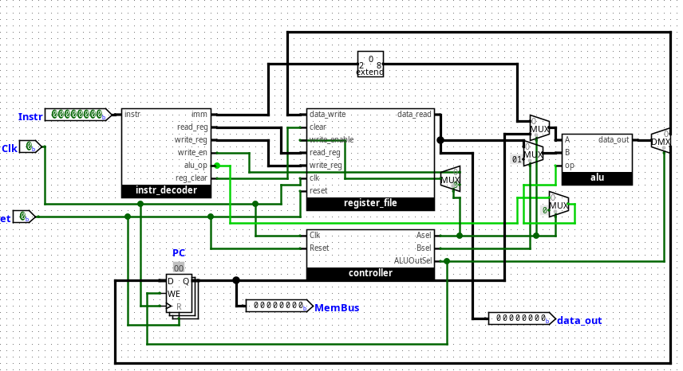

# a_cpu
An actual 8 bit cpu

# Image

# What is this?

This was a project for CSCB58. The cpu supports addition and binary and, and has 4 registers. The instruction set is decently simple, and an example exists in the .circ file.

# How to run/see

Use logism evolution
